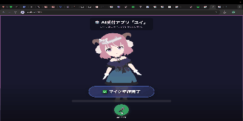

##  About Me
-  KADOKAWAドワンゴ情報工科学院大学部所属
-  将来はARを主体とした分野に関われたらと思い日々昇進中！！
-  基本的に新しいことには全力で関わりに行きます！！
-  インターン募集中
  
##  参加した企画・プロジェクト

-  [2024夏モテ活アプリ](https://github.com/vantan-project/motekatu)  
  → Djangoで開発。**"モテるための活動"（モテ活）**をテーマに、ユーザーのレビューをまとめたプラットフォーム型アプリケーション。  
  HTMLをWebアプリとして動作させるためのコードの書き換えを中心に担当しました（チーム参加）。

-  [Web AR](https://github.com/tatuki1107/WebAR)  
  → 文化祭で**全て一人で制作**したWeb ARコンテンツ。
  [こちらから確認できます](https://tatuki1107.github.io/WebAR/) 

-  [2024冬 サントリーグローバルイノベーションセンター様 × 産学連携企画](https://github.com/Akasan-T/TECJUM-teamE_hikariwo)  
  → Djangoで開発。データベースの要件定義、HTMLのWebアプリ化対応、バックエンド処理などを全て担当しました（チーム参加）。

-  [3Dモデル対話AI](https://github.com/tatuki1107/bunkasaichatAI)  
  → ２年次文化祭で3Dモデルからバックエンドまで**全て一人で制作**した対話型chatAI。grok aniをイメージして作りました。
**アプリの実際の動きはこちら👇**

##  技術スタック
### Languages

### Tools & Frameworks

##  GitHub Stats

##  Contact
-  メール: kuwano.t.24kdgn@gmail.com
- ポートフォリオ:現在準備中
