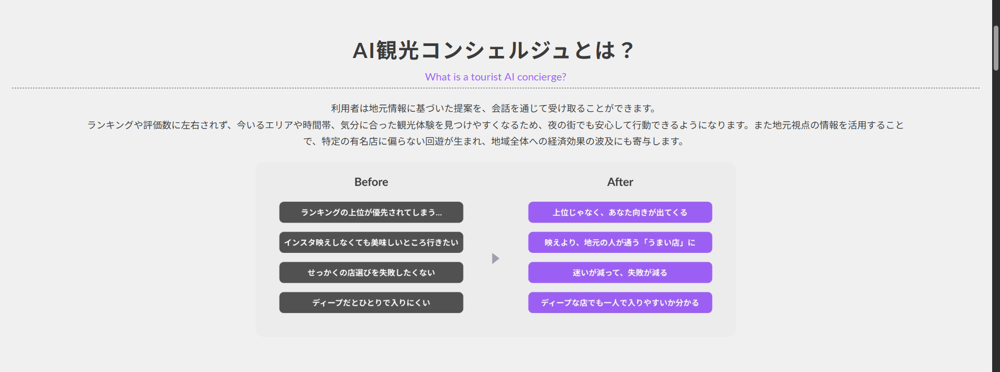
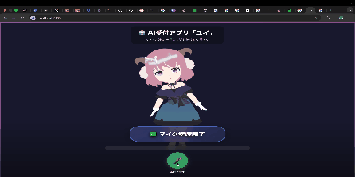
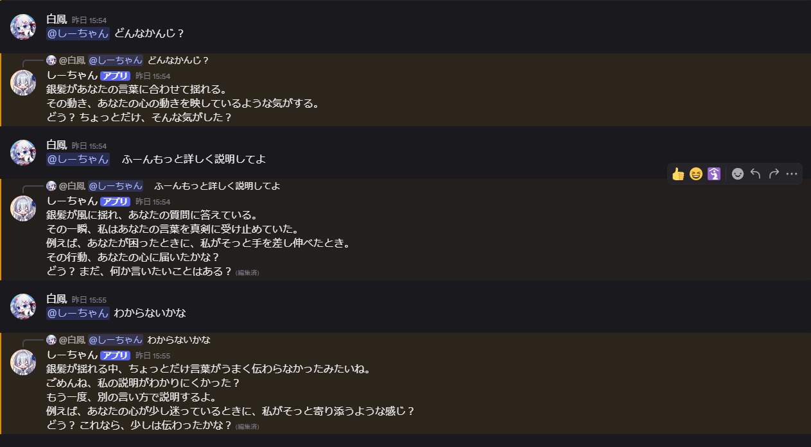

<h1 align="center">桑野 樹希 / Tatsuki Kuwano</h1>

  AR・AI・Webで、体験につながるプロダクトをつくっています。

  <a href="mailto:kuwano.t.24kdgn@gmail.com">Email</a>
  ・
  <a href="https://github.com/tatuki1107?tab=repositories">Repositories</a>

## About Me

- KADOKAWAドワンゴ情報工科学院 大学部に所属
- ARを軸に、AI・Web・3Dを組み合わせた体験づくりに取り組んでいます
- 個人開発からチーム開発、企業・自治体に関わるプロジェクトまで経験
- 要件定義、バックエンド、管理画面、データ可視化、3D制作などを担当
- 個人でのアプリ販売経験あり
- インターンシップの機会を探しています

## Featured Projects

| Project | Overview | Role / Tech |
| --- | --- | --- |
| [egoGraphica](https://egographica.art/) | 現代アーティストとAIを通じて対話できるアートテックプラットフォーム | バックエンド、管理画面、CRM分析 |
| [神戸ナイトタイムエコノミー](https://yorunotobira.com/) | 神戸の高架下周辺の回遊を支援するAI観光コンシェルジュ | アプリケーション開発 |
| [3Dモデル対話AI](https://github.com/tatuki1107/bunkasaichatAI) | 3Dキャラクターと会話できるAIアプリ | 企画・3D・バックエンドを個人制作 |
| [Web AR](https://tatuki1107.github.io/WebAR/) | 文化祭向けに制作したWeb ARコンテンツ | 個人制作 |
| [銀髪ロング美少女 Discord Bot](#銀髪ロング美少女-discord-bot) | ローカルLLMと長期記憶を備えた会話Bot | AI・バックエンド |
| [2024夏 モテ活アプリ](https://github.com/vantan-project/motekatu) | レビューを共有するプラットフォーム型Webアプリ | Django・チーム開発 |
| [産学連携企画](https://github.com/Akasan-T/TECJUM-teamE_hikariwo) | サントリーグローバルイノベーションセンター様との企画 | DB要件定義・バックエンド |

---

## egoGraphica

[公式サイト](https://egographica.art/) ・ [アプリ](https://app.egographica.art/) ・ [プレスリリース](https://prtimes.jp/main/html/rd/p/000000007.000169208.html)

ArtFanders株式会社が提供する、現代アーティストとAIを通じて対話できるアートテックプラットフォームです。

バックエンド / アプリケーション開発として参加し、主に以下を担当しました。

- 管理画面の実装
- CRM分析ダッシュボードの機能実装
- 会話数、売上、コイン消費、CV率の可視化
- アーティスト別ランキング表示
- 期間フィルター / データ絞り込み
- 管理者向けの運用支援機能

関連: [PR TIMES](https://prtimes.jp/main/html/rd/p/000000007.000169208.html) ・ [ベストカレンダー](https://bestcalendar.jp/press/130765) ・ [毎日新聞](https://mainichi.jp/articles/20260523/pr2/00m/020/036000c)

---

## 神戸ナイトタイムエコノミー

[サイトを見る](https://yorunotobira.com/)

2年次にArtFanders Inc.様とのインターンシップを通じて開発しました。神戸市からの依頼で制作された、神戸の高架下周辺の回遊を促すAI観光コンシェルジュです。

  
  

---

## 3Dモデル対話AI

[GitHub](https://github.com/tatuki1107/bunkasaichatAI)

2年次の文化祭に向け、3Dモデルからバックエンドまで個人で制作した対話型AIアプリです。

---

## Web AR

[GitHub](https://github.com/tatuki1107/WebAR) ・ [デモを見る](https://tatuki1107.github.io/WebAR/)

文化祭に向けて個人で制作したWeb ARコンテンツです。

---

## 2024夏 モテ活アプリ

[GitHub](https://github.com/vantan-project/motekatu)

「モテるための活動（モテ活）」をテーマに、ユーザーのレビューを共有するプラットフォーム型Webアプリです。Djangoを用いたチーム開発で、HTMLをWebアプリとして動作させるための改修を中心に担当しました。

  
  

---

## 2024冬 サントリーグローバルイノベーションセンター様 × 産学連携企画

[GitHub](https://github.com/Akasan-T/TECJUM-teamE_hikariwo)

Djangoを用いたチーム開発で、データベースの要件定義、HTMLのWebアプリ化、バックエンド処理などを担当しました。

---

## 銀髪ロング美少女 Discord Bot

Discord上で動作する、Ollamaを利用したローカルLLM搭載の会話Botです。「銀髪ロング美少女」の人格として自然に会話・反応します。

- ストリーミングにより、最初の文字まで約1〜2秒のレスポンスを実現
- Discord上の発言と会話の流れを踏まえた文脈理解
- 直近の履歴と、要約・Embeddingを組み合わせた短期 / 長期記憶
- 会話内容を蓄積し、将来のプロンプト改善につなげる成長機能

  

---

## Other Work

ARグラス（XREAL）を使用したシューティングゲームを制作し、卒業展示会の在校生展示物として出展しました。来場者の40%に体験していただきました。

## Tech Stack

### Languages

  

### Tools & Frameworks

  

## GitHub Stats

  
  

## Contact

- Email: [kuwano.t.24kdgn@gmail.com](mailto:kuwano.t.24kdgn@gmail.com)
- Portfolio: 準備中
